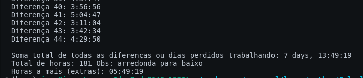

# Overtime-Calculator

  Aplicação que calcula as horas extras com base em um arquivo externo txt com as suas horas trabalhadas.
Fiz esse software porque meu chefe perguntava se eu tinha feito tantas horas extras e pedia pra confirmar, mas eu não tinha como ter certeza porque o registro dos pontos
não mostrava, então fiz para meu controle.

## Como funciona

  Crie um arquivo txt chamado data ```data.txt``` e adicione as datas e horarios trabalhados (OBS: Não tem verificação se no arquivo não tem o numero de registros pares
então garanta isso. Porque o programa vai ler linhas pares como se fosse o inicio do expediente até o almoço e do almoço até o fim do expediente) 

Exemplo de uma data: ``` 07/05/2024 11:41:31 ```

  Rode o programa, ele vai sugerir um numero de dias trabalhados para você mas esse valor vc vai informar para ele. Depois de informar o número de dias trabalhados
ele vai mostrar individualmente cada horario em cada periodo trabalhado, a soma total dos dias/horas que vc trabalhou no mês e as horas extras que foram feitas

